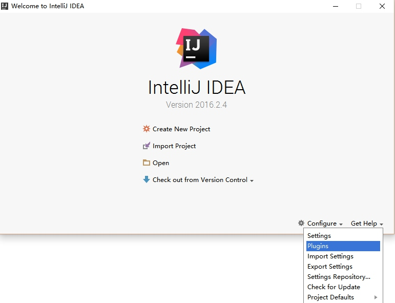
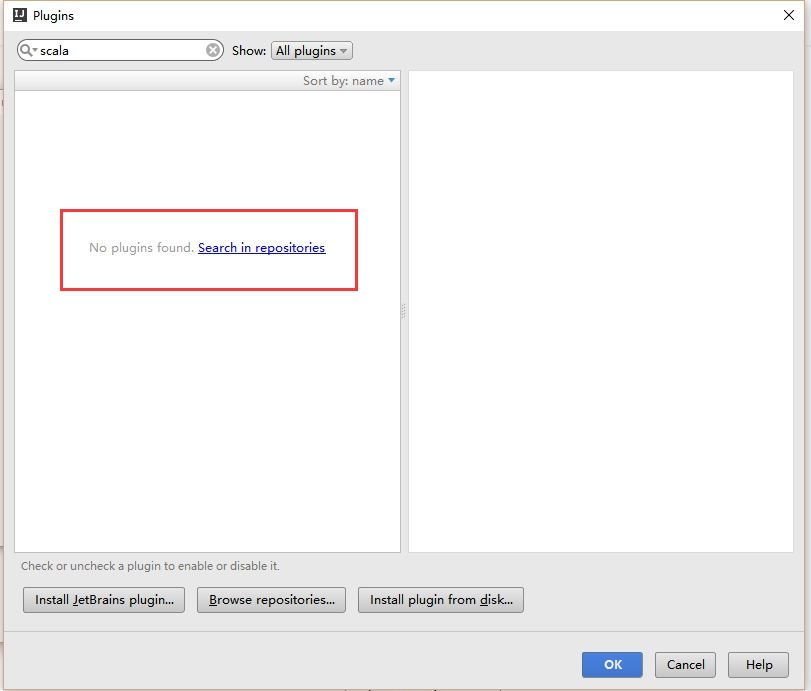
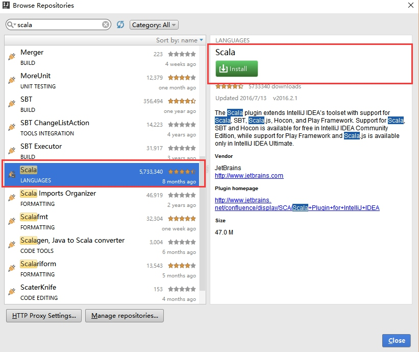
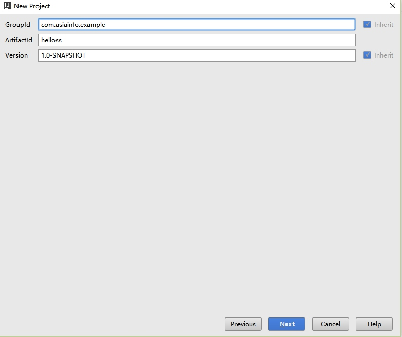
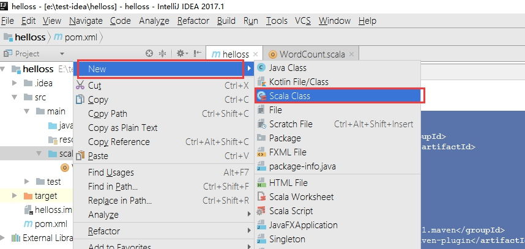
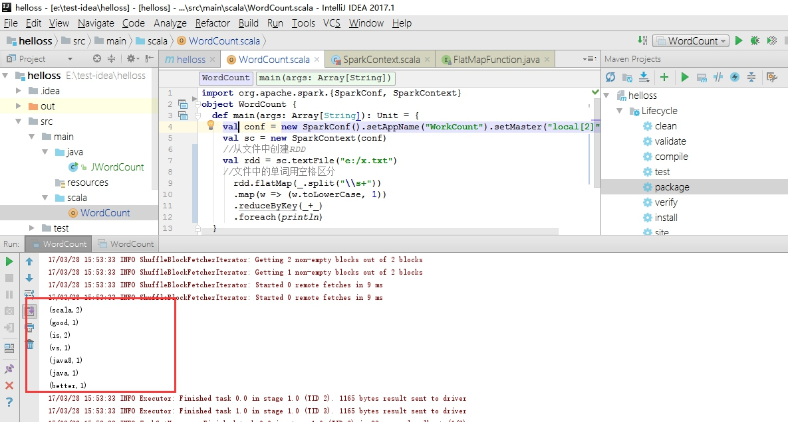
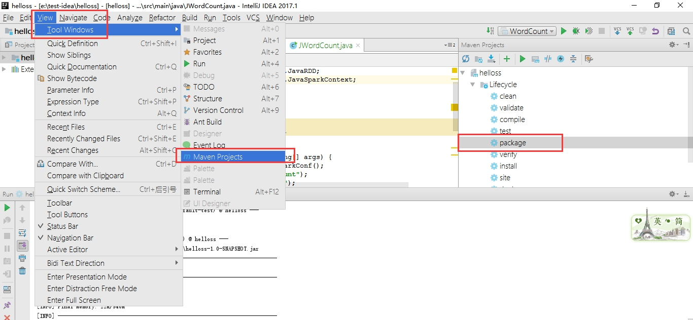
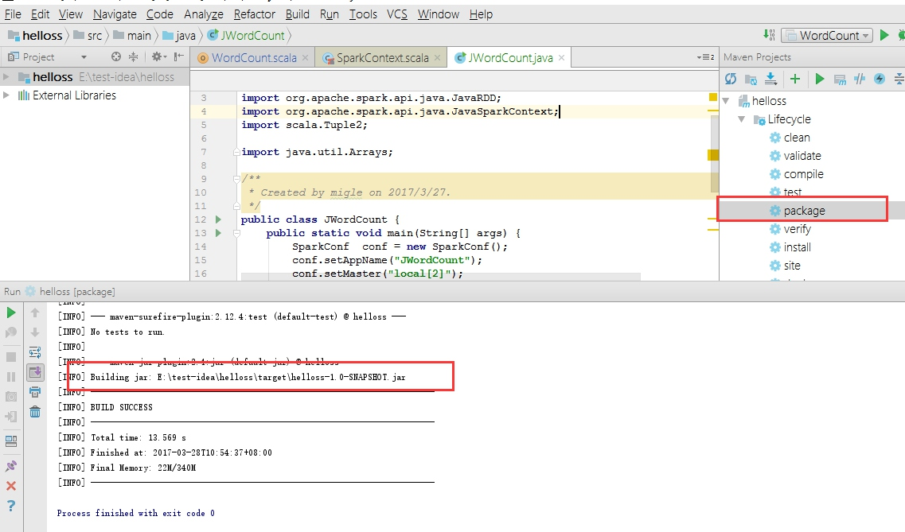
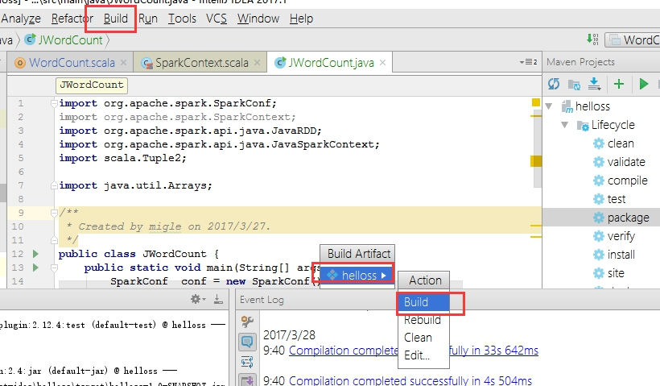
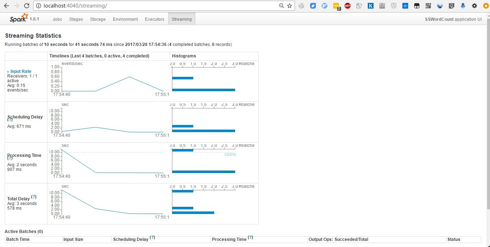

## 概要
目前Spark官方提供Java,Scala,Python三种语言的API。因为Spark是用Scala开发，而Scala本身是基于JVM的语言，所以Scala和Java的API完整稳定；Python相对不太完整，有些新特性刚开始不支持，但Python语言简单明了，且省去了编译打包，用起稍微能方便一些。  
本文件将介绍在IDEA+Maven环境下使用Java和Scala的开发Spark和SparkStreaming程序的过程。包括开发工具安装、配置、scala&java混合项目创建、样例代码开发、运行、打包。详细API介绍不在本文范围，请查阅官方文档。  
>>参考资料
1. 官方文档:<http://spark.apache.org/docs/>  :英文，所有版本的都在这里面。最权威也比较全面。
2. 汉化的官方文档  <http://ifeve.com/spark/> ：v1.6官方文档汉化版。1.3.0到1.6之间API之间变化不大，可以参考。

## 开发工具&&环境
本小节介绍IDEA、scala插件的安装，如果您已经安装好了IDEA & Scala插件，请直接跳过这一节。
###  安装IDEA   
<https://www.jetbrains.com/idea/>选择社区版即可，免费的！    
IDEA自带maven，所以不用再单独下载安装了:)，也可以不用IDEA自带的，安装完成后在在“setting”->"maven"中设置一下即可  
>>*注意:  
>>JDK是必须的啦，而且是版本要1.8+哦*  
>>maven构建时会根据pom.xml中的配置从网络仓库中下载依赖包，所以要联网，网速要好^_^ 

###  安装Scala插件
安装完成后打开IDEA,选择"configure"-> "Plugins"


搜索"scala"没有结果，点击"Search in repositories"

在搜索结果中选择"scala" 选择“install”安装完成后需要重启


>>最新社区版的IDEA在安装完成后的初始界面就已经提供了"scala插件"的安装选择，直接选择即可  
>>scala插件是在用scala开发Spark程序时所需要，如果只是用java开发，可以不用安装，考虑到有时候会看scala代码，有这个插件还是方便很多

## Spark WordCount
本小节通过用Scala和Java8分别实现一个简单的统计单词个数的程序为例，依次介绍工程创建、编码、测试运行、打包的完整过程。
### 创建工程
1. 新建工程  
"create new project" -> "maven" ，如下图

填写相关信息  


2. 创建scala代码目录
IDEA的maven工程会默认创建java代码的目录，scala代码目录需要手工创建，在"main"目录下新建“scala”目录 ，如下图


3. 将*main/scala*添加至源代码目录  
"File"->"project structure"(快捷键:ALT+CTRL+SHIFT+S) ->"Modules"->" main/scala" 右键单击，选择 "Sources" 添加至源代码目录如下图


### 声明依赖  
使用maven的好处在于只需要在pom.xml声明一下依赖，maven会自动处理，而不需要我们手工下载每个依赖包添加到classpath中，此项目中我们需要在pom.xml中声明scala库、scala编译插件及spark的依赖，在pom.xml中`<project>`标签中添加以下内容  
```
<dependencies>
    <!--scala项目需要-->
    <dependency>
        <groupId>org.scala-lang</groupId>
        <artifactId>scala-compiler</artifactId>
        <version>2.10.4</version>
        <scope>compile</scope>
    </dependency>
    <!--spark程序依赖-->
    <dependency>
        <groupId>org.apache.spark</groupId>
        <artifactId>spark-core_2.10</artifactId>
        <version>1.6.1</version>
      </dependency>
    </dependencies>
    <build>
        <plugins>
        <!--scala项目需要-->
            <plugin>
                <groupId>net.alchim31.maven</groupId>
                <artifactId>scala-maven-plugin</artifactId>
                <executions>
                    <execution>
                        <id>scala-compile-first</id>
                        <!--[maven lifecycle](http://maven.apache.org/guides/introduction/introduction-to-the-lifecycle.html)-->
                        <phase>process-resources</phase>
                        <goals>
                            <goal>add-source</goal>
                            <goal>compile</goal>
                        </goals>
                    </execution>
                </executions>
            </plugin>
        </plugins>
    </build>
```
>>*注意:*开发依赖的spark版本和scala的版本要兼容，<artifactId>spark-core_${scala.binary.version}</artifactId>，${scala.binary.version}要和spark编译的scala版本一致，官方发布二进制的都是2.10


### 代码开发
样例代码以统计文件中的单词个数为例，单词间以空格分开，计数不区分大小写。
>>待统计文件内容很简单如下x.txt，只有三行：   
Java vs Scala  
java8 is good   
scala is better      

####  **scala**  版代码
在scala目录上右键单击，选择“NEW”->"Scala Class" 如下图：

然后在弹出的对话框中输入类名"WordCount"，选择“Kind”为"object" *默认为class*

//WordCount.scala
```
object WordCount {
  def main(args: Array[String]): Unit = {
    val conf = new SparkConf().setAppName("WorkCount").setMaster("local[2]")
    val sc = new SparkContext(conf)
    //从文件中创建RDD
    val rdd = sc.textFile("e:/x.txt")
    //文件中的单词用空格区分
    rdd.flatMap(_.split("\\s+"))
      .map(w => (w, 1))
      .reduceByKey(_+_)
      .foreach(println)
  }
}
```
#### **java**  版代码
功能和scala一样，用JAVA8实现代码也简洁了很多，限了需要声明类型外，几乎和scala一样。
右键单击“main/java”新建Java类 JWordCount  
//JWordCount.java
```
    public static void main(String[] args) {
        SparkConf  conf = new SparkConf();
        conf.setAppName("JWordCount");
        conf.setMaster("local[2]");
        JavaSparkContext sc = new JavaSparkContext(conf);
        JavaRDD<String> rdd = sc.textFile("e:/x.txt");

        rdd.flatMap(line-> Arrays.asList(line.split("\\s+")))
                .mapToPair(w -> new Tuple2<String,Integer>(w.toLowerCase(),1))
                .reduceByKey((a,b)->a+b)
                .foreach(w-> System.out.println(w));
    }
```

Scala和Java程序运行方式一样，在左侧"project"窗口中右键单击文件(或在编辑窗口中)，选择“Run 'WordCount'”(快捷键:Ctrl+Shift+F10)，可以分别运行一下，以下是scala版运行的结果:


*src/main/java*和*src/main/scala*下分别放java和scala代码。可以用java实现基础代码，在scala中调用。 
>>一般开发时master不会写死，会由参数传进去，这种方式可以边开发边测试，不需要部署一套spark集群，提高开发效率。
>>在IDEA中可以通过"Run"->"Editor Configurations"->"添加 or 选择 主类"-> "program arguments" 来添加程序参数，以方便测试，如果开发环境可以直接连接spark集群，可以直接传入master的地址，提交至集群中运行。

### 打包  
程序开发完毕不管最终是以spark on yarn 还是spark standalone方式运行，都需要首先要将开发的程序以及依赖打成jar包，然后一般会通过`spark-submit`这个脚本来提交至集群中运行。在IDEA+Maven的环境下可以用maven来打包，也可以用IDEA来打包，各有各的优点，maven功能强大灵活，可以实现一些复杂的流程和功能，且可以脱离IDEA运行在命令行中，可以和其它自动化工具方便集成，但强大功能配置起来比较麻烦。IDEA自身的打包相对简单，对日常开发足够用了。  

不管是用java还是scala开发的spark程序，提交到集群时，spark本身及其依赖是不需要打包到程序中的，也就是说要打入程序包中的是除spark以及其依赖之外的包是需要打入程序包中的。像本文的例子程序只依赖scala和spark本身，spark依赖scala，所以只需要打包开发的程序即可，不需要打入其它依赖包，用IDEA或Maven打包都很方便，下面分别介绍两种打包方式。
#### maven
打开"maven project": "view"->"tool windows"->"maven project"

在"maven project" 中选择 "lifecycle"->package 右单击选择"Run Maven Build" 运行结束后，工程中的scala的java都会被编码打包。工程目录下的target/下会有jar包生成,如下图。

>>maven更多功能和或种NB的插件可以问狗哥或度娘！  

#### IDEA打包
IDEA要稍显复杂，要多点几次鼠标。"File"->"project structure"(快捷键:ALT+CTRL+SHIFT+S) ->"artifacts"->选择"+" ->"jar"->"empty"
在"Name"中填入jar名称 ，"Output directory"为输入jar包的路径，然后在"available elements"中右单击'helloss compile output'选择'pack into Output Root'，点'OK'保存，如下图
>>'helloss compile output'只是你当前工程中源码编译出来的class。如果要打入其它依赖包，也在此选择加入即可


打包： “build”->"helloss"(你起的名字)->"build"即可


完整代码可以见：<https://github.com/longforfreedom/hellospark>    
生产环境中要提交到集群中运行时一般会用spark-submit来提交运行，类似以下语句:`spark-submit --master yarn-client  --num-executors 10 --executor-memory 20g --executor-cores 10  --class "WordCount"   helloss-1.0-SNAPSHOT.jar`
集群部署方式不一样 **--master** 后面的参数不一样，部分参数也会有一些不同， 更多信息可以参考:<http://spark.apache.org/docs/1.6.2/submitting-applications.html>  ，程序的部署和运行监控后续会有单独进行介绍。  

>>一般情况开发的spark程序不会以local方式正式运行，但能以这样方式运行对于开发、测试非常方便，需要注意的是有些情况local方式运行正确，但在集群中不一定能正确运行。因为以local方式运行时Spark的所有角色(Driver,Master,Worker,Executor)f是在本地的同一个JVM中，以多个线程运行，具体的任务执行是一个或多个线程，而集群中运行时是不同机器不同的JVM中运行，需要注意并发问题。

以上介绍完了IDEA+Maven环境下用scala和java各开发了一个简单单词计数Spark程序的完整过程，包括开发环境搭建，工程创建，代码开发，以及测试运行，打包。在这个程序中数据源来自文件，程序运行时需要处理的数据已确定，数据处理完毕，程序结束。但是如果数据是动态的，源源不断的，比如来自socket或消息队列中时，要简单及时的处理这些数据时就需要引入流处理了，下面介绍用spark streaming从kafka中统计单词个数的示例程序。

## SparkStreaming && Kafka WordCount
### 运行环境
如果您不是很了解kafka或着手头没有可以使用的kafka集群，可以用以下方式快速搭建一个测试环境。
本文环境为windows+VMware(Centos)，kafka是在vmware下的centos中运行,centos的hostname:*vm-centos-00*，IP:*192.168.99.130*
>>kafka也可以直接在windows中运行，运行bin/windows下的启动脚本即可。
>>**注意：**如果kafka和消费者和服务器以及zookeeper没有在同一台机器上时，需要将kafka server和zookeeper的hostname加到消费者机器的hosts文件中。比如本文中，需要在windows的*C:\WINDOWS\System32\drivers\etc\hosts*文件中添加一条记录`192.168.99.130  vm-centos-00`  否则消费时会出错  

1. 下载kafka： `wget http://mirror.bit.edu.cn/apache/kafka/0.9.0.0/kafka_2.10-0.9.0.0.tgz`  
2. 解压: `tar zxvf kafka_2.10-0.9.0.0.tgz `
3. 启动kafka: 
```
 cd kafka_2.10-0.9.0.0   
 ## 启动zookeeper
 bin/zookeeper-server-start.sh config/zookeeper.properties
 ## 新开一个终端窗口，启动kafka
 bin/kafka-server-start.sh config/server.properties
```
4. 创建topic:`bin/kafka-topics.sh --create --zookeeper vm-centos-00:2181 --replication-factor 1 --partitions 3 --topic helloss`   
5. 启动生产者`bin/kafka-console-producer.sh --broker-list vm-centos-00:9092   --topic helloss`    
6. 启动消费者`bin/kafka-console-consumer.sh --zookeeper   vm-centos-00:2181 --from-beginning --topic helloss`     
可以在生产者窗户中输入消息，在消费者窗口中查看。测试无误后可以进入下一步
###  创建工程
这一步和spark程序一样，为方便起间，本文直接在之前spark程序工程中添加代码
### 添加依赖
需要添加scala库、scala编译插件是必须的。SparkStreaming和以及与Kafka的集成依赖包也需要引入，在前面spark程序的项目基础上，在pom.xml中添加以下内容
>>由于spark streaming依赖spark core，所以在pom.xml中添加spark streaming后，可以不用显式声明spark core的依赖，spark core的依赖会自动加进来
```
 <dependency>
     <groupId>org.apache.spark</groupId>
     <artifactId>spark-streaming_2.10</artifactId>
     <version>1.6.1</version>
 </dependency>
<!--与kafka集成时需要-->
  <dependency>
     <groupId>org.apache.spark</groupId>
     <artifactId>spark-streaming-kafka_2.10</artifactId>
     <version>1.6.1</version>
 </dependency>
```
### 代码开发
在scala目录上右键单击，选择“NEW”->"Scala Class",新增一个名为SSWordCount的object。代码如下
#### scala
//SSWordCount.scala
```
object SSWordCount {
  def main(args: Array[String]): Unit = {
      //方便起间，程序中写死以local方式运行
    val sparkConf = new SparkConf().setAppName("SSWordCount").setMaster("local[2]")
   //每10秒钟统计一次接收到单词数    
    val ssc = new StreamingContext(sparkConf, Seconds(10))
    val topicMap = Map("helloss"-> 1)
    val messages = KafkaUtils.createStream(ssc,"vm-centos-00:2181","ss-group",topicMap)
    val r = messages.map(_._2).flatMap(_.split("\\s+")).map((_,1)).reduceByKey(_+_)
    //只打印10记录，实际中一般会保存到HDFS，Redis,Kafka中
    //spark streaming需要一个Output Operations来触发执行，否则再多的Transformations也不会执行
    r.print(10)
    //启动Streaming程序
     ssc.start()
    ssc.awaitTermination()
  }
}
```
//JSSWordCount.java
```
 public static void main(String[] args) {
        SparkConf conf = new SparkConf();
        conf.setAppName("JSSWordCount");
        conf.setMaster("local[2]");
        JavaStreamingContext jssc = new JavaStreamingContext(conf, Durations.seconds(20));
        Map<String, Integer> topicMap = new HashMap<>();
        topicMap.put("helloss",1);
        JavaPairReceiverInputDStream<String, String> messages =
                KafkaUtils.createStream(jssc, "vm-centos-00:2181","ss-group",topicMap);
        JavaPairDStream<String, Integer> r = messages.map(x -> x._2())
                .flatMap(line -> Arrays.asList(line.split("\\s+")))
                .mapToPair(w -> new Tuple2<String, Integer>(w.toLowerCase(), 1))
                .reduceByKey((a, b) -> a + b);
        r.print(10);
        jssc.start();
        jssc.awaitTermination();
    }
```
完整代码可以见：<https://github.com/longforfreedom/hellospark>    
运行程序后，在前面打开的消费者窗口中输入消息  

在IDEA中观察输出情况，可以看到类似如下输出：


可以通过Spark Web UI<http://localhost:4040/>来监控流处理程序运行情况，比如延迟多少批次，已处理完成多少个批次等等,如下图所示




打包、部署运行和spark程序没有区别，但需要注意的是spark程序处理结束后会自动退出，释放资源。而spark streaming处理的是连续不断的数据，程序不会退出，即使kafka中没有数据也不会释放资源，更不会退出(出错了当然就结束了:( )

## 结束
本文只是简单的介绍了开发工具安装、配置，并通过两个简单的例子介绍了IDEA+Maven环境下使用Java8和Scala的开发spark和spark streaming程序的过程。Spark、Spark Streaming以及Kafka涉及很多知识点，详细的部署方式以及参数设置，运行监控后续会慢慢整理介绍。